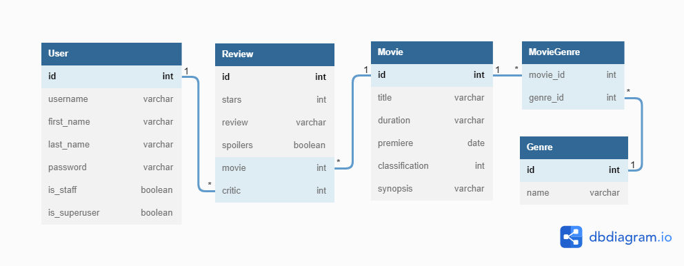

KMDb
========

Esse projeto simula um sistema de avaliação/crítica de filmes, parecida com o IMDb.

A plataforma KMDb possui um ou mais admins que ficarão responsáveis pelo cadastro dos filmes e um ou mais críticos que irão escrever as avaliações para os filmes cadastrados.


* * *
Como rodar a aplicação?
--------

1. Crie um arquivo .env na raiz da aplicação seguindo o exemplo contido no arquivo .env.example.
2. Crie um ambiente virtual - `python -m venv venv`
3. Ative o venv - `source venv/bin/activate`
4. Execute as migrações - `python manage.py migrate`
5. Levante o servidor - `python manage.py runserver`


* * *

Diagrama Entidade/Relacionamento
--------------------------------




* * *

Sobre Usuários (`User`):
------------------------

- Admin - será responsável por criar e deletar os filmes na plataforma.
- Crítico - não poderão criar ou deletar filmes, mas sim criar as avaliações para eles.

Para diferenciar entre os tipos de acesso, os usuários serão diferenciados através dos campos `is_staff` e `is_superuser`, sendo que:

- Crítico - terá os campos `is_staff == True` e `is_superuser == False`.
- Admin - terá ambos os campos `is_staff` e `is_superuser` com o valor True.

`POST /api/accounts/` - criando um usuário

```
// REQUEST
{
  "username": "user",
  "password": "1234",
  "first_name": "John",
  "last_name": "Wick",
  "is_superuser": false,
  "is_staff": false
} 
```

```
// RESPONSE STATUS -> HTTP 201
{
  "id": 1,
  "username": "user",
  "first_name": "John",
  "last_name": "Wick",
  "is_superuser": false,
  "is_staff": false,
}
```

`POST /api/login/` - obtendo um token para o usuário

```
// REQUEST
{
  "username": "admin",
  "password": "1234"
}
```

```
// REQUEST STATUS -> HTTP 200
{
  "token": "0f500a8c2f2f8d5e77ad86b3a8d373a0528d8812"
}
```

* * *

Sobre Filmes (`Movie`) e Avaliações (`Review`)
-------------------


`POST /api/movies/` - criando um novo filme
```
// REQUEST 
// Header -> Authorization: Token <token-do-admin>
// REQUEST
// Header -> Authorization: Token <token-do-admin>
{
  "title": "O Poderoso Chefão 2",
  "duration": "175m",
  "genres": [
    {"name": "Crime"},
    {"name": "Drama"}
  ],
  "premiere": "1972-09-10",
  "classification": 14,
  "synopsis": "Don Vito Corleone (Marlon Brando) é o chefe de uma 'família' ..."
}
```

```
// RESPONSE STATUS -> HTTP 201
// RESPONSE STATUS -> HTTP 201 CREATED
{
  "id": 1,
  "title": "O Poderoso Chefão 2",
  "duration": "175m",
  "genres": [
    {
      "id": 1,
      "name": "Crime"
    },
    {
      "id": 2,
      "name": "Drama"
    }
  ],
  "premiere": "1972-09-10",
  "classification": 14,
  "synopsis": "Don Vito Corleone (Marlon Brando) é o chefe de uma ..."
}
```

`POST /api/movies/{movie_id}/review/` - criação de um review de um crítico

```
// REQUEST
// Header -> Authorization: Token <token-de-critic>
{
  "stars": 7,
  "review": "O Poderoso Chefão 2 podia ter dado muito errado...",
  "spoilers": false,
}
```

```
// RESPONSE STATUS 201 CREATED
{
  "id": 1,
  "critic": {
    "id": 1,
    "first_name": "Jacques",
    "last_name": "Aumont"
  },
  "stars": 7,
  "review": "O Poderoso Chefão 2 podia ter dado muito errado...",
  "spoilers": false
}
```

`PUT /api/movies/{movie_id}>/review/` - Alteração uma crítica já realizada

```
// REQUEST
// Header -> Authorization: Token <token-do-critic>
// Todos os campos são obrigatórios
{
  "stars": 2,
  "review": "O Poderoso Chefão 2 podia ter dado muito certo..",
  "spoilers": true
}
```

```
//RESPONSE
{
  "id": 1,
  "critic": {
    "id": 1,
    "first_name": "Jacques",
    "last_name": "Aumont"
  },
  "stars": 2,
  "review": "O Poderoso Chefão 2 podia ter dado muito certo..",
  "spoilers": true
}
```

`GET /api/reviews/` - Lista as reviews que foram realizadas

```
// REQUEST
// Header -> Authorization: Token <token-do-admin>
```

```
// RESPONSE STATUS -> HTTP 200 OK
[
  {
    "id":1,
    "critic":{
      "id":1,
      "first_name":"Jacques",
      "last_name":"Aumont"
    },
    "stars":2,
    "review":"O Poderoso Chefão 2 podia ter dado muito certo..",
    "spoilers":true,
    "movie": 1
   },
   {
    "id":2,
    "critic":{
      "id":2,
      "first_name":"Bruce",
      "last_name":"Wayne"
    },
    "stars": 8,
    "review":"Não consegui ver até o final, fiquei com medo",
    "spoilers":false,
    "movie": 2
   },
   {
    "id":3,
    "critic":{
      "id":2,
      "first_name":"Bruce",
      "last_name":"Wayne"
    },
    "stars":10,
    "review":"Melhor filme que já assisti",
    "spoilers":true
    "movie": 1
  }
]
```

`GET /api/movies/` - Lista todos os filmes cadastrados

```
// RESPONSE STATUS -> 200 OK
[
  {
    "id": 1,
    "title": "O Poderoso Chefão 2",
    "duration": "175m",
    "genres": [
      {
        "id": 1,
        "name": "Crime"
      },
      {
        "id": 2,
        "name": "Drama"
      }
    ],
    "premiere": "1972-09-10",
    "classification": 14,
    "synopsis": "Don Vito Corleone (Marlon Brando) é o chefe de uma 'família' ..."
  },
  {
    "id": 2,
    "title": "Um Sonho de Liberdade",
    "duration": "142m",
    "genres": [
      {
        "id": 2,
        "name": "Drama"
      },
      {
        "id": 4,
        "name": "Ficção científica"
      }
    ],
    "premiere": "1994-10-14",
    "classification": 16,
    "synopsis": "Andy Dufresne é condenado a duas prisões perpétuas..."
  }
]
```

`GET /api/movies?title=<nome>` - Lista todos os filmes cadastrados com base na filtragem do request

```
// RESPONSE STATUS 200 OK
[
  {
    "id": 2,
    "title": "Um Sonho de Liberdade",
    "duration": "142m",
    "genres": [
      {
        "id": 2,
        "name": "Drama"
      },
      {
        "id": 3,
        "name": "Ficção científica"
      }
    ],
    "premiere": "1994-10-14",
    "classification": 16,
    "synopsis": "Andy Dufresne é condenado a duas prisões perpétuas..."
  },
  {
    "id": 3,
    "title": "Em busca da liberdade",
    "duration": "175m",
    "genres": [
      {
        "id": 2,
        "name": "Drama"
        },
        {
          "id": 4,
          "name": "Obra de época"
        }
    ],
    "premiere": "2018-02-22",
    "classification": 14,
    "synopsis": "Representando a Grã-Bretanha,  corredor Eric Liddell",
  }
]  
```

`GET /api/movies/{movie_id}/` - Rota que busca o filme especificado pelo id

```
// REQUEST
// Header -> Authorization: Token <token-do-critic ou token-do-admin>         
```

```
// RESPONSE STATUS -> HTTP 200 OK
{
  "id": 9,
  "title": "Nomadland",
  "duration": "110m",
  "genres": [
    {
      "id": 2,
      "name": "Drama"
    },
    {
      "id": 4,
      "name": "Obra de Época"
    }
  ],
  "premiere": "2021-04-15",
  "classification": 14,
  "synopsis": "Uma mulher na casa dos 60 anos que, depois de perder...",
  "reviews": [
    {
      "id": 5,
      "critic": {
        "id": 1,
        "first_name": "Jacques",
        "last_name": "Aumont"
      },
      "stars": 8,
      "review": "Nomadland apresenta fortes credenciais para ser favorito ...",
      "spoilers": false
    }
  ]
}
```

`DELETE /api/movies/{movie_id}/` - Rota que deleta filmes

```
// REQUEST
// Header -> Authorization: Token <token-do-admin>
```

```
// RESPONSE STATUS -> HTTP 204
```

* * *

Resumo dos Endpoints:
----------

URLs:
-----

| Método | Endpoint | Responsabilidade |
|--- |--- |--- |
| POST | /api/accounts/ | Criação de usuários |
| POST | /api/login/ | Faz a autenticação do usuário |
| POST | /api/movies/ | Faz a criação de um filme (Somente admin) |
| GET | /api/movies/ | Lista todos os filmes, também vai ser possível filtrar por título do filme |
| GET | /api/movies/{movie_id}/ | Retorna um filme com o id, incluindo as reviews caso o usuário esteja autenticado e sem reviews caso não esteja autenticado |
| PUT | /api/movies/{movie_id}/ | Atualiza o registro de um filme (Somente admin) |
| DELETE | /api/movies/{movie_id}/ | Deleta um filme (Somente admin) |
| POST | /api/movies/{movie_id}/review/ | Cria uma review, vinculado ao usuário logado (apenas crítico) |
| PUT | /api/movies/{movie_id}/review/ | Atualiza uma crítica de um usuário (apenas crítico) |
| GET | /api/reviews/ | Lista as reviews, todas se o usuário for admin ou apenas do próprio usuário se for crítico |

* * *